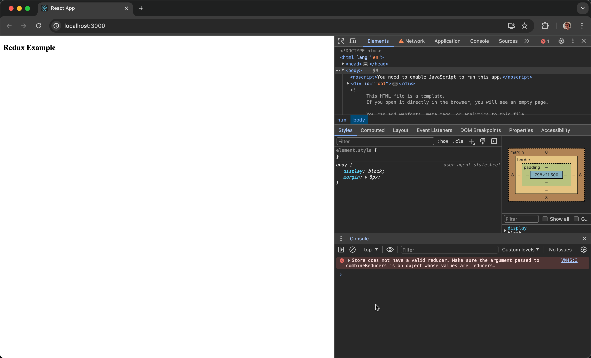
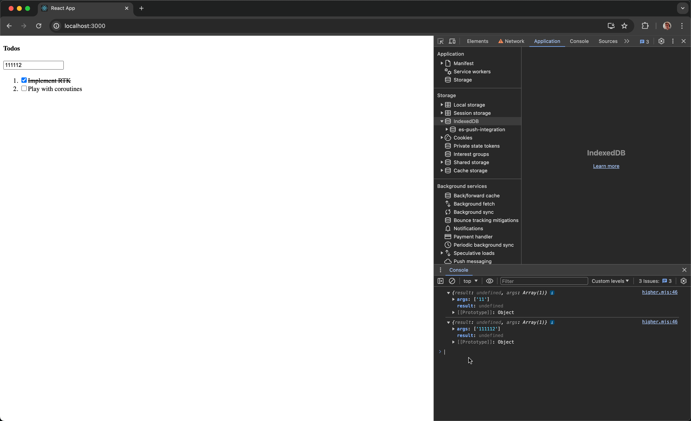
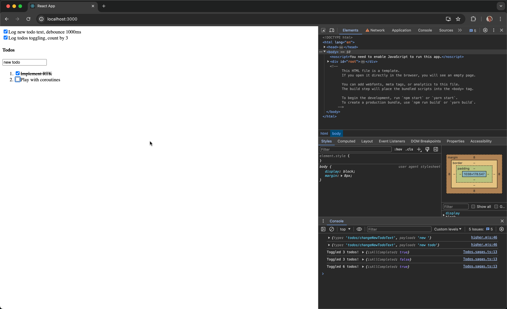

# MobX Tutorial

This guide shows how to use Promise Saga with [MobX](https://mobx.js.org). Step-by-step, we will create a simple React Todo app to introduce you to the [basic concepts](../basics.md). You can easily find all the [source code](#source-code) at the end of this tutorial.

## Configure your project

### 0. Install and set up [Create React App](https://create-react-app.dev)
If you don't wish to create a project from scratch, create a demo project from a template.

```bash
npx create-react-app --template=cra-template-typescript demo-mobx
```

Remove its `src/` directory and proceed further.
```bash
cd demo-mobx && rm src/*
```

### 1. Install required dependencies
Add the Promise Saga and MobX packages to the project.

```bash
npm install mobx mobx-react-lite @promise-saga/core @promise-saga/plugin-default @promise-saga/plugin-react
```

### 2. Create application starting point
Create an `index.tsx` file.

```tsx title="index.tsx"
import {createRoot} from 'react-dom/client';
import App from './components/App';

const node = document.getElementById('root') as HTMLElement;
const root = createRoot(node);

root.render(<App />);
```

### 3. Configure sagas
Configure sagas once for your project.

```ts title="saga.ts"
import {createCreateSaga} from '@promise-saga/core';
import {plugin} from '@promise-saga/plugin-default';

export const createSaga = createCreateSaga({plugin});
```

### 4. Create App component
```tsx title="components/App.tsx"
export default function App() {
  return (
    <h4>Todo List</h4>
  );
}
```

Run `npm start` from your command line to see an empty app.



## Implement TodoList

### 5. Create TodoList component
```tsx title="components/TodoList.tsx"
import {KeyboardEventHandler, useRef} from 'react';

// initial todos to show
const todos = [
  {id: 1, text: 'Implement RTK', isCompleted: true},
  {id: 2, text: 'Play with coroutines'},
];

export default function TodoList() {
  // `new todo` text field ref
  const newTodoText = useRef<HTMLInputElement>(null);

  const addTodo: KeyboardEventHandler<HTMLInputElement> = (e) => {
    // handler to add todo with `text`
  };

  const toggleTodo = (id: number) => {
    // handler to toggle todo by `id`
  };

  return (
    <>
      <h4>Todos</h4>

      <input
        type="text"
        placeholder="New todo"
        ref={newTodoText} // attach `new todo` ref
        onKeyDown={addTodo}
      />

      <ol>
        {todos.map((todo) => ( // create an ordered list of todos
          <li key={todo.id}>
            <label
              style={{
                textDecoration:
                  todo.isCompleted
                    ? 'line-through' // cross out completed todos
                    : 'none'
              }}
            >
              <input
                type="checkbox"
                checked={todo.isCompleted || false}
                onChange={() => toggleTodo(todo.id)} // checkbox to toggle todo
              />
              
              {todo.text}
            </label>
          </li>
        ))}
      </ol>
    </>
  );
}
```

Turn on the App component in `components/App.tsx`.

```tsx title="components/App.tsx"
// highlight-start
import TodoList from './TodoList';
// highlight-end

export default function App() {
  return (
    // highlight-start
    <TodoList />
    // highlight-end
  );
}
```

Having no logic, the application is not interactive for now.

### 6. Create TodoList model

Create a `models` directory and a `Todos.ts` file in it. Configure MobX's model.

```ts title="models/Todos.ts"
import {makeObservable, observable} from 'mobx';

// Create Todo type
type ITodo = {
  id: number;
  text: string;
  isCompleted?: boolean;
};

class TodosStore {
  data: ITodo[] = [ // set todos to model initialState
    {id: 1, text: 'Implement RTK', isCompleted: true},
    {id: 2, text: 'Play with coroutines'},
  ];

  constructor() {
    makeObservable(this, {
      data: observable,
    });
  }

  // handler to add todo with `text`
  addTodo(text: string) {
    this.data.push({
      id: Date.now(),
      text,
      isCompleted: false,
    });
  }

  // handler to toggle todo by `id`
  toggleTodo(id: number) {
    const todo = this.data.find((todo) => todo.id === id);
    if (todo) todo.isCompleted = !todo.isCompleted;
  }
}

export default new TodosStore();
```

### 7. Bind Todos model to UI component

```tsx title="components/TodoList.tsx"
import {KeyboardEventHandler, useRef} from 'react';
// highlight-start
import {observer} from 'mobx-react-lite';
import Todos from '../models/Todos'; // import a model
// highlight-end

// highlight-start
const TodoList = observer(() => {
// highlight-end
  const newTodoText = useRef<HTMLInputElement>(null);

  const addTodo: KeyboardEventHandler<HTMLInputElement> = (e) => {
    // highlight-start
    // if `Enter` pressed
    if (e.key === 'Enter') {
      // pass text input value to `addTodo` handler
      Todos.addTodo(e.currentTarget.value);

      if (newTodoText.current) {
        // clear text input value if rendered
        newTodoText.current.value = '';
      }
    }
    // highlight-end
  };

  const toggleTodo = (id: number) => {
    // highlight-start
    // pass todo id to `toggleTodo` handler
    Todos.toggleTodo(id);
    // highlight-end
  };

  return (
    <>
      <h4>Todos</h4>

      <input
        type="text"
        placeholder="New todo"
        ref={newTodoText}
        onKeyDown={addTodo}
      />

      <ol>
        {Todos.data.map((todo) => (
          <li key={todo.id}>
            <label style={{textDecoration: todo.isCompleted ? 'line-through' : 'none'}}>
              <input
                type="checkbox"
                checked={todo.isCompleted || false}
                onChange={() => toggleTodo(todo.id)}
              />

              {todo.text}
            </label>
          </li>
        ))}
      </ol>
    </>
  );
});

export default TodoList;
```

At this point, you have an interactive TodoList app, and you can `add` and `complete` todos with it:


## Playing with sagas

### 8. Create first saga to play
For instance, let us count todos being completed by 3 and log to the console if they're all actually completed at this certain point of time. Edit `models/Todos.ts` for that.

```ts title="models/Todos.ts"
import {makeObservable, observable} from 'mobx';
import {createSaga} from '../saga';

type ITodo = {
  id: number;
  text: string;
  isCompleted?: boolean;
};

class TodosStore {
  data: ITodo[] = [
    {id: 1, text: 'Implement RTK', isCompleted: true},
    {id: 2, text: 'Play with coroutines'},
  ];

  constructor() {
    makeObservable(this, {
      data: observable,
    });
  }

  getData = () => this.data;

  addTodo(text: string) {
    this.data.push({
      id: Date.now(),
      text,
      isCompleted: false,
    });
  }

  toggleTodo(id: number) {
    const todo = this.data.find((todo) => todo.id === id);
    if (todo) todo.isCompleted = !todo.isCompleted;
  }

  // highlight-start
  // create a saga to listen for todo `toggles`
  listenTodoToggles = createSaga(async function () {
    for (let i = 1; ; i++) { // listen forever
      await this.take(this.toggleTodo); // wait for `toggle` action to happen

      if (i % 3 === 0) { // count `toggles` by 3
        const todos = this.getData(); // get todos list
        const isAllCompleted = todos.every((todo) => todo.isCompleted); // define if all todos completed
        
        console.log(`Toggled ${i} todos!`, {isAllCompleted});
      }
    }
  }, {extraThis: this}); // pass `this` to have access to model methods
  // highlight-end
}

export default new TodosStore();
```

### 9. Wrap methods to createAction
At this point, you're going to get an error while calling `await this.take` because raw MobX model methods are not takeable. Try wrapping MobX methods with a Promise Saga `createAction` helper.

```ts title="models/Todos.ts"
import {makeObservable, observable} from 'mobx';
// highlight-start
import {createAction} from '@promise-saga/plugin-default';
// highlight-end
import {createSaga} from '../saga';

type ITodo = {
  id: number;
  text: string;
  isCompleted?: boolean;
};

class TodosStore {
  data: ITodo[] = [
    {id: 1, text: 'Implement RTK', isCompleted: true},
    {id: 2, text: 'Play with coroutines'},
  ];

  constructor() {
    makeObservable(this, {
      data: observable,
    });
  }

  getData = () => this.data;

  // highlight-start
  addTodo = createAction((text: string) => {
    // highlight-end
    this.data.push({
      id: Date.now(),
      text,
      isCompleted: false,
    });
    // highlight-start
  });
  // highlight-end

  // highlight-start
  toggleTodo = createAction((id: number) => {
    // highlight-end
    const todo = this.data.find((todo) => todo.id === id);
    if (todo) todo.isCompleted = !todo.isCompleted;
    // highlight-start
  });
  // highlight-end

  listenTodoToggles = createSaga(async function () {
    for (let i = 1; ; i++) {
      await this.take(this.toggleTodo);

      if (i % 3 === 0) {
        const todos = this.getData();
        const isAllCompleted = todos.every((todo) => todo.isCompleted);

        console.log(`Toggled ${i} todos!`, {isAllCompleted});
      }
    }
  }, {extraThis: this});
}

export default new TodosStore();
```

Use the saga on an App level, for example.
```tsx title="components/App.tsx"
import {observer} from 'mobx-react-lite';
import {useSaga} from '@promise-saga/plugin-react';
import TodoList from './TodoList';
import Todos from '../models/Todos';

// highlight-start
const App = observer(() => {
  useSaga(Todos.listenTodoToggles);
  // highlight-end

  return (
    <TodoList />
  );
// highlight-start
});

export default App;
// highlight-end
```

Test the example by toggling todos, counted by 3 now:


### 10. Try Promise Saga hooks

You've already used some lower effects in the previous step, like `take` and `select`.

Now, let's see how to debounce text input value with some additional saga hooks, implementing higher effects inside. Turn them on in `saga.ts`.

```ts title="saga.ts"
import {createCreateSaga} from '@promise-saga/core';
// highlight-start
import {plugin, createHigherHooks} from '@promise-saga/plugin-default';
// highlight-end

export const createSaga = createCreateSaga({plugin});

// highlight-start
export const {
  useTakeEvery,
  useTakeLeading,
  useTakeLatest,
  useDebounce,
  useThrottle,
} = createHigherHooks(createSaga);
// highlight-end
```

### 11. Create action for testing

Name it `changeNewTodoText` to be clear.

```ts title="models/Todos.ts"
import {makeObservable, observable} from 'mobx';
import {createAction} from '@promise-saga/plugin-default';
import {createSaga} from '../saga';

type ITodo = {
  id: number;
  text: string;
  isCompleted?: boolean;
};

class TodosStore {
  data: ITodo[] = [
    {id: 1, text: 'Implement RTK', isCompleted: true},
    {id: 2, text: 'Play with coroutines'},
  ];

  constructor() {
    makeObservable(this, {
      data: observable,
    });
  }

  getData = () => this.data;

  // highlight-start
  changeNewTodoText = createAction();
  // highlight-end

  addTodo = createAction((text: string) => {
    this.data.push({
      id: Date.now(),
      text,
      isCompleted: false,
    });
  });

  toggleTodo = createAction((id: number) => {
    const todo = this.data.find((todo) => todo.id === id);
    if (todo) todo.isCompleted = !todo.isCompleted;
  });

  listenTodoToggles = createSaga(async function () {
    for (let i = 1; ; i++) {
      await this.take(this.toggleTodo);

      if (i % 3 === 0) {
        const todos = this.getData();
        const isAllCompleted = todos.every((todo) => todo.isCompleted);

        console.log(`Toggled ${i} todos!`, {isAllCompleted});
      }
    }
  }, {extraThis: this});
}

export default new TodosStore();
```

### 12. Call an action on input change

Call the `changeNewTodoText` action once the new todo text gets changed.

```tsx title="components/TodoList.tsx"
// highlight-start
import {ChangeEventHandler, KeyboardEventHandler, useRef} from 'react';
// highlight-end
import {observer} from 'mobx-react-lite';
import Todos from '../models/Todos';

const TodoList = observer(() => {
  const newTodoText = useRef<HTMLInputElement>(null);

  const addTodo: KeyboardEventHandler<HTMLInputElement> = (e) => {
    if (e.key === 'Enter') {
      Todos.addTodo(e.currentTarget.value);

      if (newTodoText.current) {
        newTodoText.current.value = '';
      }
    }
  };

  const toggleTodo = (id: number) => {
    Todos.toggleTodo(id);
  };

  // highlight-start
  const changeNewTodo: ChangeEventHandler<HTMLInputElement> = (e) => {
    Todos.changeNewTodoText(e.currentTarget.value);
  };
  // highlight-end

  return (
    <>
      <h4>Todos</h4>

      <input
        type="text"
        placeholder="New todo"
        ref={newTodoText}
        onKeyDown={addTodo}
        // highlight-start
        onChange={changeNewTodo}
        // highlight-end
      />

      <ol>
        {Todos.data.map((todo) => (
          <li key={todo.id}>
            <label style={{textDecoration: todo.isCompleted ? 'line-through' : 'none'}}>
              <input
                type="checkbox"
                checked={todo.isCompleted || false}
                onChange={() => toggleTodo(todo.id)}
              />

              {todo.text}
            </label>
          </li>
        ))}
      </ol>
    </>
  );
});

export default TodoList;
```

### 13. Debounce text input

Bind the debouncing MobX action to a simple handler like `console.log`.

```tsx title="components/App.tsx"
import {observer} from 'mobx-react-lite';
import {useSaga} from '@promise-saga/plugin-react';
import {useDebounce} from '../saga';
import Todos from '../models/Todos';
import TodoList from './TodoList';

const App = observer(() => {
  useSaga(Todos.listenTodoToggles);
  useDebounce(1000, Todos.changeNewTodoText, console.log);

  return (
    <TodoList />
  );
});

export default App;
```

Test it. Your new todo text is going to be logged once 1000ms pass after input finished:



### 14. Manage advanced sagas canceling

Both sagas used above within a React component are automatically cancelled on component unmount and called again on component mount. But you might want to have more control over sagas flow. Since every saga returns a `SagaIterator`, you can toggle it.

```tsx title="components/App.tsx"
import {observer} from 'mobx-react-lite';
import {useSaga} from '@promise-saga/plugin-react';
import {useDebounce} from '../saga';
import Todos from '../models/Todos';
import TodoList from './TodoList';

// checkbox component to control saga flow
const SagaCheckbox = ({flow}: {flow: ReturnType<typeof useSaga>}) => (
  <input type="checkbox" onChange={flow.toggle} checked={flow.isRunning} />
);

const App = observer(() => {
  // highlight-start
  // save saga iterators to variables
  const listenTogglesFlow = useSaga(Todos.listenTodoToggles);
  const logNewTodoFlow = useDebounce(1000, Todos.changeNewTodoText, console.log);
  // highlight-end

  return (
    // highlight-start
    <>
      <div>
        <label>
          <SagaCheckbox flow={logNewTodoFlow} />
          Log new todo text, debounce 1000ms
        </label>
      </div>

      <div>
        <label>
          <SagaCheckbox flow={listenTogglesFlow} />
          Log todos toggling, count by 3
        </label>
      </div>

      <TodoList />
    </>
    // highlight-end
  );
});

export default App;
```

Test the result! Since we've implemented checkboxes controlling sagas flow, notice that:
1. Changing new todo text is debounced with a timeout of 1000ms (1st checkbox). Changing the text input and turning its saga off instantly doesn't give any effect, as the saga gets cancelled sooner.
2. Todos toggling is counted by 3 (2nd checkbox). Turning this checkbox off and back resets the counter, as the saga flow gets renewed.



## Source code

Refer to the complete [MobX example](../examples.md#mobx) for more information.
