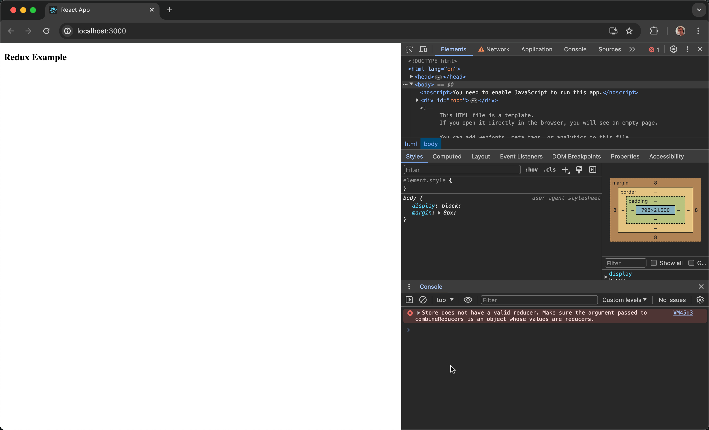
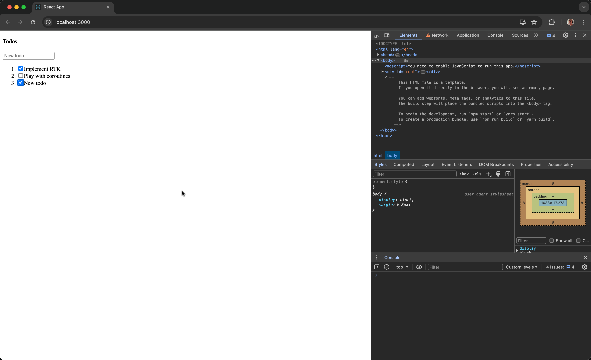

# Redux Tutorial

This guide shows how to use Promise Saga with [Redux](https://redux.js.org) and [Redux Toolkit](https://redux-toolkit.js.org). Step-by-step, we will create a simple React Todo app to introduce you to the [basic concepts](../basics.md). You can easily find all the [source code](#source-code) at the end of this tutorial.

## Configure your project

### 0. Install and set up [Create React App](https://create-react-app.dev)
If you don't wish to create a project from scratch, create a demo project from a template.

```bash
npx create-react-app --template=cra-template-typescript demo-redux
```

Remove its `src/` directory and proceed further.
```bash
cd demo-redux && rm src/*
```

### 1. Install required dependencies
Add the Promise Saga, Redux Toolkit, and React Redux packages to the project.

```bash
npm install @reduxjs/toolkit react-redux @promise-saga/core @promise-saga/plugin-react @promise-saga/plugin-redux
```

### 2. Create application starting point
Create an `index.tsx` file for that.
```tsx title="index.tsx"
import {createRoot} from 'react-dom/client';
import App from './components/App';

const node = document.getElementById('root') as HTMLElement;
const root = createRoot(node);

root.render(<App />);
```

### 3. Configure Redux store with sagas
Create a `store` directory and an `index.ts` file in it. Configure the Redux store with added sagas support.
```ts title="store/index.ts"
import {configureStore, Tuple} from '@reduxjs/toolkit';
import {createSagaMiddleware} from '@promise-saga/plugin-redux';

export default configureStore({
  reducer: {},

  // create a Redux middleware
  middleware: () => new Tuple(createSagaMiddleware()),
});
```

Configure sagas once for your project.
```ts title="store/saga.ts"
import {createCreateSaga} from '@promise-saga/core';
import {plugin} from '@promise-saga/plugin-redux';

export const createSaga = createCreateSaga({plugin});
```

### 4. Create App component
Provide the Redux store to the React application.
```tsx title="components/App.tsx"
import {Provider} from 'react-redux';
import store from '../store';

export default function App() {
  return (
    <Provider store={store}>
      <h4>Todo List</h4>
    </Provider>
  );
}
```

Run `npm start` from your command line to see an empty app:



## Implement TodoList

### 5. Create TodoList component
```tsx title="components/TodoList.tsx"
import {KeyboardEventHandler, useRef} from 'react';

// initial todos to show
const todos = [
  {id: 1, text: 'Implement RTK', isCompleted: true},
  {id: 2, text: 'Play with coroutines'},
];

export default function TodoList() {
  // `new todo` text field ref
  const newTodoText = useRef<HTMLInputElement>(null);

  const addTodo: KeyboardEventHandler<HTMLInputElement> = (e) => {
    // handler to add todo with `text`
  };

  const toggleTodo = (id: number) => {
    // handler to toggle todo by `id`
  };

  return (
    <>
      <h4>Todos</h4>

      <input
        type="text"
        placeholder="New todo"
        ref={newTodoText} // attach `new todo` ref
        onKeyDown={addTodo}
      />

      <ol>
        {todos.map((todo) => ( // create an ordered list of todos
          <li key={todo.id}>
            <label
              style={{
                textDecoration:
                  todo.isCompleted
                    ? 'line-through' // cross out completed todos
                    : 'none'
              }}
            >
              <input
                type="checkbox"
                checked={todo.isCompleted || false}
                onChange={() => toggleTodo(todo.id)} // checkbox to toggle todo
              />
              
              {todo.text}
            </label>
          </li>
        ))}
      </ol>
    </>
  );
}
```

And turn it on in `components/App.tsx`:

```tsx title="components/App.tsx"
import {Provider} from 'react-redux';
// highlight-start
import TodoList from './TodoList';
// highlight-end
import store from '../store';

export default function App() {
  return (
    <Provider store={store}>
      // highlight-start
      <TodoList />
      // highlight-end
    </Provider>
  );
}
```

Having no logic, the application is not interactive for now.

### 6. Create TodoList model
Create a `models` directory and a `Todos.ts` file in it. Configure Redux Toolkit's slice.

```ts title="models/Todos.ts"
import {createSlice, PayloadAction} from '@reduxjs/toolkit';

// Create Todo type
type ITodo = {
  id: number;
  text: string;
  isCompleted?: boolean;
};

// Create Todos slice state type
type ITodosState = {
  todos: ITodo[];
};

export default createSlice({
  name: 'todos',

  initialState: {
    todos: [ // set todos to slice initialState
      {id: 1, text: 'Implement RTK', isCompleted: true},
      {id: 2, text: 'Play with coroutines'},
    ],
  },

  reducers: {
    // handler to add todo with `text`
    addTodo(state: ITodosState, action: PayloadAction<string>) {
      state.todos.push({
        id: Date.now(),
        text: action.payload,
      });
    },

    // handler to toggle todo by `id`
    toggleTodo(state: ITodosState, action: PayloadAction<number>) {
      const todo = state.todos.find((todo) => todo.id === action.payload);
      if (todo) todo.isCompleted = !todo.isCompleted; // toggle `isCompleted`
    },
  },

  selectors: {
    // selector to get todos list
    getTodos: (state: ITodosState) => state.todos,
  },
});
```

### 7. Add Todos reducer to the store

```ts title="store.ts"
import {configureStore, Tuple} from '@reduxjs/toolkit';
import {createSagaMiddleware} from '@promise-saga/plugin-redux';
// highlight-start
import Todos from '../models/Todos';
// highlight-end

export default configureStore({
  // highlight-start
  reducer: {
    todos: Todos.reducer,
  },
  // highlight-end
  middleware: () => new Tuple(createSagaMiddleware()),
});
```

### 8. Bind Todos model to UI component

```tsx title="components/TodoList.tsx"
import {KeyboardEventHandler, useRef} from 'react';
// highlight-start
import {useDispatch, useSelector} from 'react-redux';
import Todos from '../models/Todos'; // import a model
// highlight-end

export default function TodoList() {
  // highlight-start
  const dispatch = useDispatch();
  const todos = useSelector(Todos.selectors.getTodos); // get todos list
  // highlight-end
  const newTodoText = useRef<HTMLInputElement>(null);

  const addTodo: KeyboardEventHandler<HTMLInputElement> = (e) => {
    // highlight-start
    // if `Enter` pressed
    if (e.key === 'Enter') {
      // pass text input value to `addTodo` action
      dispatch(Todos.actions.addTodo(e.currentTarget.value));
      
      if (newTodoText.current) {
        // clear text input value if rendered
        newTodoText.current.value = '';
      }
    }
    // highlight-end
  };

  const toggleTodo = (id: number) => {
    // highlight-start
    // pass todo id to `toggleTodo` action
    dispatch(Todos.actions.toggleTodo(id));
    // highlight-end
  };

  return (
    <>
      <h4>Todos</h4>

      <input
        type="text"
        placeholder="New todo"
        ref={newTodoText}
        onKeyDown={addTodo}
      />

      <ol>
        {todos.map((todo) => (
          <li key={todo.id}>
            <label style={{textDecoration: todo.isCompleted ? 'line-through' : 'none'}}>
              <input
                type="checkbox"
                checked={todo.isCompleted || false}
                onChange={() => toggleTodo(todo.id)}
              />

              {todo.text}
            </label>
          </li>
        ))}
      </ol>
    </>
  );
}
```

At this point, you have an interactive TodoList app, and you can `add` and `complete` todos with it:



## Playing with sagas

### 9. Create first saga to play
For instance, let us count todos being completed by 3 and log to the console if they're all actually completed at this certain point of time. Create a `models/Todos.sagas.ts` for that.

```ts title="models/Todos.sagas.ts"
import {createSaga} from '../store/saga';
import Todos from './Todos';

// create a saga to listen for todo `toggles`
export const listenTodoToggles = createSaga(async function () {
  for (let i = 1; ; i++) { // listen forever
    await this.take(Todos.actions.toggleTodo); // wait for `toggle` action to happen

    if (i % 3 === 0) { // count `toggles` by 3
      const todos = this.select(Todos.selectors.getTodos); // get todos list
      const isAllCompleted = todos.every((todo) => todo.isCompleted); // define if all todos completed

      console.log(`Toggled ${i} todos!`, {isAllCompleted}); // log!
    }
  }
});
```

Use the saga on an App level, for example.
```tsx title="components/App.tsx"
import {Provider} from 'react-redux';
// highlight-start
import {useSaga} from '@promise-saga/plugin-react';
import {listenTodoToggles} from '../models/Todos.sagas';
// highlight-end
import TodoList from './TodoList';
import store from '../store';

export default function App() {
  // highlight-start
  useSaga(listenTodoToggles); // use a saga
  // highlight-end

  return (
    <Provider store={store}>
      <TodoList />
    </Provider>
  );
}
```

Test the example by toggling todos, counted by 3 now:


### 10. Try Promise Saga hooks
You've already used some lower effects in the previous step, like `take` and `select`.

Now, let's see how to debounce text input value with some additional saga hooks, implementing higher effects inside. Turn them on in `store/saga.ts`.

```ts title="store/saga.ts"
import {createCreateSaga} from '@promise-saga/core';
// highlight-start
import {plugin, createHigherHooks} from '@promise-saga/plugin-redux';
// highlight-end

export const createSaga = createCreateSaga({plugin});

// highlight-start
export const {
  useTakeEvery,
  useTakeLeading,
  useTakeLatest,
  useDebounce,
  useThrottle,
} = createHigherHooks(createSaga);
// highlight-end
```

### 11. Create action for testing
Name it `changeNewTodoText` to be clear.

```ts title="models/Todos.ts"
import {createSlice, PayloadAction} from '@reduxjs/toolkit';

type ITodo = {
  id: number;
  text: string;
  isCompleted?: boolean;
};

type ITodosState = {
  todos: ITodo[];
};

export default createSlice({
  name: 'todos',

  initialState: {
    todos: [
      {id: 1, text: 'Implement RTK', isCompleted: true},
      {id: 2, text: 'Play with coroutines'},
    ],
  },

  reducers: {
    addTodo(state: ITodosState, action: PayloadAction<string>) {
      state.todos.push({
        id: Date.now(),
        text: action.payload,
      });
    },

    toggleTodo(state: ITodosState, action: PayloadAction<number>) {
      const todo = state.todos.find((todo) => todo.id === action.payload);
      if (todo) todo.isCompleted = !todo.isCompleted;
    },

    // highlight-start
    changeNewTodoText(state: ITodosState, action: PayloadAction<string>) { }
    // highlight-end
  },

  selectors: {
    getTodos: (state: ITodosState) => state.todos,
  },
});
```

### 12. Dispatch action on input change
Dispatch the `changeNewTodoText` action once the new todo text gets changed.

```tsx title="components/TodoList.tsx"
// highlight-start
import {ChangeEventHandler, KeyboardEventHandler, useRef} from 'react';
// highlight-end
import {useDispatch, useSelector} from 'react-redux';
import Todos from '../models/Todos';

export default function TodoList() {
  const dispatch = useDispatch();
  const todos = useSelector(Todos.selectors.getTodos);
  const newTodoText = useRef<HTMLInputElement>(null);

  const addTodo: KeyboardEventHandler<HTMLInputElement> = (e) => {
    if (e.key === 'Enter') {
      dispatch(Todos.actions.addTodo(e.currentTarget.value));

      if (newTodoText.current) {
        newTodoText.current.value = '';
      }
    }
  };

  const toggleTodo = (id: number) => {
    dispatch(Todos.actions.toggleTodo(id));
  };

  // highlight-start
  const changeNewTodo: ChangeEventHandler<HTMLInputElement> = (e) => {
    dispatch(Todos.actions.changeNewTodoText(e.currentTarget.value));
  };
  // highlight-end

  return (
    <>
      <h4>Todos</h4>

      <input
        type="text"
        placeholder="New todo"
        ref={newTodoText}
        onKeyDown={addTodo}
        // highlight-start
        onChange={changeNewTodo}
        // highlight-end
      />

      <ol>
        {todos.map((todo) => (
          <li key={todo.id}>
            <label style={{textDecoration: todo.isCompleted ? 'line-through' : 'none'}}>
              <input
                type="checkbox"
                checked={todo.isCompleted || false}
                onChange={() => toggleTodo(todo.id)}
              />

              {todo.text}
            </label>
          </li>
        ))}
      </ol>
    </>
  );
}
```

### 13. Debounce text input
Bind the debouncing Redux action to a simple handler like `console.log`.

```tsx title="components/App.tsx"
import {Provider} from 'react-redux';
import {useSaga} from '@promise-saga/plugin-react';
import {listenTodoToggles} from '../models/Todos.sagas';
import TodoList from './TodoList';
// highlight-start
import Todos from '../models/Todos';
import {useDebounce} from '../store/saga';
// highlight-end
import store from '../store';

export default function App() {
  useSaga(listenTodoToggles);
  // highlight-start
  useDebounce(1000, Todos.actions.changeNewTodoText, console.log);
  // highlight-end

  return (
    <Provider store={store}>
      <TodoList />
    </Provider>
  );
}
```

Test it. Your new todo text is going to be logged once 1000ms pass after input finished:


### 14. Manage advanced sagas canceling
Both sagas used above within a React component are automatically cancelled on component unmount and called again on component mount. But you might want to have more control over sagas flow. Since every saga returns a `SagaIterator`, you can toggle it.

```tsx title="components/App.tsx"
import {Provider} from 'react-redux';
import {useSaga} from '@promise-saga/plugin-react';
import {listenTodoToggles} from '../models/Todos.sagas';
import TodoList from './TodoList';
import Todos from '../models/Todos';
import {useDebounce} from '../store/saga';
import store from '../store';

// checkbox component to control saga flow
const SagaCheckbox = ({flow}: {flow: ReturnType<typeof useSaga>}) => (
  <input type="checkbox" onChange={flow.toggle} checked={flow.isRunning} />
);

export default function App() {
  // highlight-start
  // save saga iterators to variables
  const listenTogglesFlow = useSaga(listenTodoToggles);
  const logNewTodoFlow = useDebounce(1000, Todos.actions.changeNewTodoText, console.log);
  // highlight-end

  return (
    <Provider store={store}>
      // highlight-start
      <div>
        <label>
          <SagaCheckbox flow={logNewTodoFlow} />
          Log new todo text, debounce 1000ms
        </label>
      </div>

      <div>
        <label>
          <SagaCheckbox flow={listenTogglesFlow} />
          Log todos toggling, count by 3
        </label>
      </div>
      // highlight-end

      <TodoList />
    </Provider>
  );
}
```

Test the result! Since we've implemented checkboxes controlling sagas flow, notice that:
1. Changing new todo text is debounced with a timeout of 1000ms (1st checkbox). Changing the text input and turning its saga off instantly doesn't give any effect, as the saga gets cancelled sooner.
2. Todos toggling is counted by 3 (2nd checkbox). Turning this checkbox off and back resets the counter, as the saga flow gets renewed.


## Source code

Refer to the complete [Redux example](../examples.md#redux) for more information.
